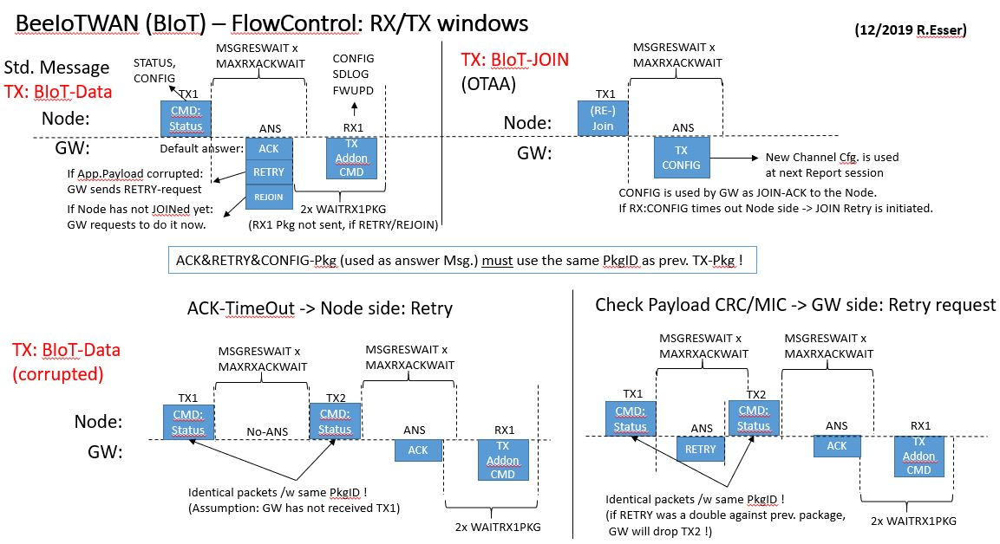
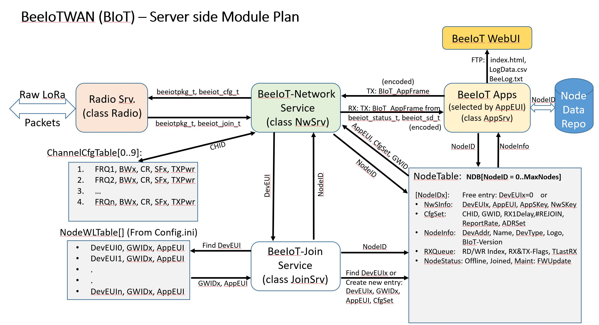

# BeeIoT-WAN Gateway v1.2
### Der Gateway zur [BeeIoT Bienenstockwaage](https://github.com/mchresse/BeeIoT/blob/master/BeeIoT_v20.md)
##### (based on Raspberry Pi)


**29.04.2020 by Randolph Esser**

---
#### Inhaltsverzeichnis:
- [Einführung](#einführung)
- [RPi-Gateway Aufbau](rpi-gateway-aufbau)
	* [RPi-Gateway RadioLayer](rpi-gateway-radiolayer)
- [BeeIoT-Client Aufbau](beeiot-client-aufbau)
	+ [Client Function Flow](client-function-flow)
	+ [Client Data Security](client-data-security)
- [BeeIoT LoRa WAN](beeiot-lora-wan)
	* [BeeIoTWAN Channel Switch](beeiot-channel-switch)
	* [BeeIoTWAN Communication packets](beeiotwan-communication-packets)
		+ [BeeIoTWAN Base Packet](beeiotwan-base-packet)
	* [BeeIoTWAN-JOIN](beeiotwan-join)
	* [Client TX/RX Sessions](client-tx/rx-sessions)
	* [Der Gateway/Server Empfangsstack](der-gateway-server-empfangsstack)
		+ [Radio Service (class Radio)](radio-service-(class-radio))
		+ [Network Service (class NwSrv)](network-service-(class-nwssrv))
		+ [JOIN Service (class JoinSrv)](join-service-(class-joinsrv))
		+ [Application Services (class AppSrv)](application-services-(class-appsrv))
- [Logging](logging)
- [BeeIoT ToDo Liste](beeiot-todo-liste)
<!-- toc -->
---


## Einführung
Nach der Beschreibung der [BeeIot Sensor Knoten](https://github.com/mchresse/BeeIoT/blob/master/BeeIoT_v20.md) auf Basis des ESP32 chipset (siehe https://Github.com/mchresse/BeeIoT), nun die passende Gegenstelle auf Raspberry Pi Basis.

Diese erfüllt (ähnlich wie bei LoRa-Wan) folgende Rollen/Services:
- Gateway Server (inkl. RADIO Service)
	- Konfiguration der Transmit channels abhängig von der Knoten session
	- Entgegennahme der BIoT LoRa Pakete (Uplink) auf der vereinbarten Modem Channel configuration
	- Versenden von BIoT Antwort Paketen.
- NetworkServer
	- Koordination der RX/TX Paket
	- Evaluation des Paket headers und Weiterleitung an den Application server
	- Bedienung des RX1 Commando Fensters im Anschluss an jedes Node Paket (optional)
- JOIN Server
	- Evaluierung von JOIN requests auf Basis einer statischen DevUID Referenztabelle
	- Verwaltung einer dynamischen Node Tabelle incl RX/Queue.
	- Verwaltung der Verschlüsselung und zug. keys
- Application Server
	- Auswertung des Frame-Payloads Applikations-spezifisch nach zugewiesener AppEUI.
	- Default App: BIoT zur Auswertung der BeeIoT Node Sensordaten
	- Weiterleitung der validierten Datenpakete für eine Webdarstellung in Form einer CSV Datei

###RPi-Gateway Aufbau
Bevor wir tief in die LoRa SW Stack details eintauchen, zunächst der HW AUfbau des RaspberryPi Gateway.
Im Single Channel Betrieb müsste leistungsmäßig ein RPi-ZeroW reichen (Der Prototyp wurde mit einem RPi 3+ gestartet).
Im folgende Diagramm sieht man das Gesamtkonzept von Sensor-Client über Gateway zum WebServer User Interface (HMI):

Alle Clients kommunizieren per default via Lora-Funk mit dem Gateway, dessen Pakete über einen JOIN Server (dazu später mehr) an die dahinter liegenden Applikation-Services zur Erst-Verarbeitung weitergereicht werden. Diese Evaluieren die LoRa Paket Frame-Payloads und extrahieren die Sensordaten zur Ablage in einer zentralen Client Datenbank. Via REST oder MQTT oder auch FTP werden die Daten an Darstellungs-Services wie der eigenen Webseite weitergeleitet.

Da in der Regel nur alle 10-15 Minuten Datenpakete der Clients (mit einer Laufzeit von 150-200ms) übertragen werden, bleibt genügend Rechenzeit die Pakete zu dekodieren, und in passende Übertragungsformate zu wandeln.
Die LAN/WiFi Anbindung ist dank Raspberry HW+OS bereits abgedeckt (Details siehe ggfs. auch in der Doku zum **["BeeLog-Projekt: BeeLogDoc_v1.3.md"](https://github.com/mchresse/BeeLog/blob/master/BeeLogDoc_v1.3.md)** auf GitHub). Daher ist "nur noch" ein LoRa Modul nötig.
Der Semtech Chip SX1276 ist der kostengünstige Standard für Lora Übertragung und in vielen HAT-Varianten verbaut. Ich habe hier den Dragino_Lora_Hat v1.4 für 868MHz mit optionalem GPS Empfänger verwendet:

Eine einfache passive Antenne ist per SMA Stecker schnell angebracht.
Einfach auf den RPi aufstecken, die RPi-SD Karte mit Debian OS installieren und los gehts:

Für die Ansteuerung des Dragino Hat's muss über das raspi-config tool noch der SPI Channel aktiviert werden und die universelle wiringPi Library downloaded und installiert werden (siehe auch dazu in der o.a. Doku des BeeLog Projektes).

Die vom HAT verwendeten SPI- und weitere Steuerleitungen sind in der Header-Datei *beelora.h* festgehalten:
```cpp
// Dragino RPi Hat with SX127x at Raspberry 40p connection: -> wPi Mode !
#define CFG_sx1276_radio		// type of Dragino Hat LoRa chip
//				WirePi-Pin:
#define LORAcs      6   // GPIO 25  		Pin 22
#define LORAdio0		7   // GPIO 4				Pin 7
#define LORAdio1		4   // GPIO 23			Pin 16
#define LORAdio2		5   // GPIO 24			Pin 18
#define LORArst     0   // GPIO 0				Pin 11
#define LORAmosi		12  // GPIO 10 MOSI Pin 19
#define LORAmiso    13  // GPIO 9  MISO Pin 21
#define LORAsck     14  // GPIO 11 SCLK Pin 23
#define RXled       LORAdio0
#define GPStxd      15  // GPIO 15 TxD -> GPS
#define GPSrxd      16  // GPIO 16 RxD -> GPS
```

**Geplante Erweiterung:**
Will man die aktuelle Single Channel HAT Variante um weitere Lora-Channel erweitern,
bestellt man sich einfach weitere Semtech Module a la RFM95 (wie auf dem HAT und bei allen Clients verbaut) und lötet sie parallel Piggy Back oben auf.

Als Auflötpunkte können die Vcc und Gnd Leitungen sowie die shared SPI Leitungen (SCK, MISO, MOSI) verwendet werden. Alle anderen DIO3-5 bleiben ungenutzt.
Folgende Anschlüsse müssen exra an einen RPi GPIO Port frei verdrahtet werden:
LoRacs(NSS), LORAdio0-2, LORArst.
So kann man den 2. SX1276 separat über eine eigene SPI Adresse ansprechen, indem man in der SW eine neue Lora-Instanz mit den o.g. NSS und RST GPIO-Ports erzeugt.

Der aktuelle Aufbau besteht aber noch aus der SingleChannel Version.
Das dadurch entstandene "RPi/HAT Paket" wird noch in eine IP67 Dichte Box verpackt (die Antenne kann bei einer Plastikbox auch intern bleiben), die LAN Leitung  wasserdicht umhüllt von einem Wetterschutzrohr herausgeführt, an den Antennenmast geschraubt. Die LAN Leitung habe ich innerhalb des Rohrs ins Haus geleitet.
Das ist der optimale Punkt um im Radius von 3-4km alle Bienenstandorte zu erreichen.

Ggfs. kann die Reichweite noch durch eine rundstrahlende LoRa Aktiv-Antenne (ca. 120€) mit +6dBm verbessert werden, macht aber für die BeeIoT-SW keine Unterschied.

####RPi-Gateway RadioLayer
Die SX1276 Konfiguration, die Steuerung der Paketübertragung sowie das IRQ handling via eigener IRQ callback Funktion habe ich abgeleitet vom LMIC radio Layer native nachimplementiert, dabei aber weitgehend die API des LMIC radio layers beibehalten.
Der NwServer verwendet folgende Schnittstellen Funktionen:
```cpp
- SetupLora()            // Detect and Initialize SX1276 chip
	* configChannel()    // preset configchannel seetings by ChannelIndex
	* configLoraModem()  // preset LoRa Modem settings for BIoT channels
	* radio_init()       // preset random matrix
	* myisr_init();      // Assign ISRs to IRQ Port DIO0-2
- starttx()              // final Packet TX routine
- startrx()              // enable RX Mode (single + contig.) -> in combination with ISR()
```
Die vom Radio-Layer implizite bei jedem IRQ aufgerufene ISR-Callback Funktion:
```
- myradio_irq_handler()  // ISR-callback for RXDone and TXDone IRQs
```
setzt im TX Mode zur Best#tigung der Sendung das *BeeIotTXFlag* und füllt im RX-Mode die RXQueue mit den Empfangs-Paketdaten und setzt schliesslich das *BeeIotRXFlag*-Semaphor.

###BeeIoT-Client Aufbau
Der Grundsätzliche HW Aufbau des ["BeeIot Sensor Knoten"](https://github.com/mchresse/BeeIoT/blob/master/BeeIoT_v20.md) wurde ja schon im BeeIoT Projekt beschrieben.
Zum Verständnis für die SW Stack Beschreibung zusammenfassend:
- Der Client verwendet ebenfalls die SX1276 Module diskret angeschlossen via SPI GPIO Ports z.B. eines ESP32
- Als Radio layer wird die Library von **"SanDeepMistry"** verwendet: https://github.com/sandeepmistry/arduino-LoRa aktuell in der version
	+ Diese unterstützt: HopeRF RFM95W, RFM96W, and RFM98W Module sowie das dragino Bee Lora shield. (allesamt Semtech Module)

Die Inbetriebnahme des LoRa Moduls wird dadurch sehr einfach.
Hier zunächst die wichtigsten Funktionen:
- Wird einanderer SPI Port als der default (SPI0) verwendet (optional):
```cpp
LoRa.setSPI(myspi);                  // new SPI Instanz of spi_t
LoRa.setSPIFrequency(spi-frequency); // default: 8MHz
```
- Instanziierung des LoRa Ports
```cpp
LoRa.begin(LoRaCfg.freq);           // default: EU868.1
```
- Zuweisung der GPIO Leitungen dem SPI Protokoll Port (siehe beeiot.h)
```cpp
 LoRa.setPins(BEE_CS, BEE_RST, BEE_DIO0);// set CS, reset, IRQ pin
```
- Das Senden eines Paketes startet mit der Reservierung eines TX Buffers:
```cpp
LoRa.beginPacket(implHdr);   // for BIoT: implHdr=0 -> explicite Header only
LoRa.write(byte);            // write single Byte to TX Buffer
LoRa.write(&date, len);      // write byte stream with "len" Byte to TX buffer
LoRa.endPacket(async);       // send buffer; async=0 - > wait for TXDone IRQ
```
Man kann auch eine TXDone Service Routine anmelden, ist BIoT client aber nicht nötig, da keine Parallelität verlangt wird, und der sync mode hinreichend prüft.
>Problem: Bleibt der TXDone aus -> Exception: muss in SW angefangen werden.
- Vorbereitung zum Empfang von Paketen: Zuweisung einer IRQ CallBack Routine:
```cpp
LoRa.onReceive(onReceive);   // Type: void onReceive(int pkglen);
```
Die ISR: onReceive(len) Funktion wird aufgerufen, wenn ein Paket vollständig in der FiFo des SX1276 eingetroffen ist (inkl. CRC check).
- Aktivierung des RX-Contiguous Mode (dauerhaftes Warten auf Pakete)
```cpp
LoRa.receive();   // No Parameter -> explicite header Mode
```

###Client Function FLow
Ein standard Arduino Sketch besteht aus der Setup() und der Loop() Phase:
Bei PowerOn startet der Boot Loader erst einmalig die Setup Phase. Anschliessend wird die Loop Funktion in einer Endlosschleife aufgerufen. Es sei denn, man geht am Ende in den Sleep() Mode. Beim darauffolgenden WakeUp (z.B. RTC getriggert) startet der bootLoader wiederum die Setup Phase.
Aus diesem Grund wird in der Setup-Funktion als erstes ein "reentrant Check" über ein resident gespeichertes Exit-Mode Flag durchgeführt.
Wird ein Sleep/Wakup Cycle erkannt, werden die residential gespeicherten Runtime Daten, welche beim Sleep Einstieg gespeichert wurden, zur Initialisierung der Betriebsstrukturen zurückgeladen. Ggfs. werden alle Sub-Setup Routinen der Sensorkomponenten nochmal durchlaufen, diesml aber im Reentrant Mode, falls eine Fallunterscheidung nötig ist.

Nach der Setupphase, in der alle Sensor- und Kommunikationsmodule sowie das ePaper Display discovered wurden, und ggfs. die letzten Runtime parameter rückgeladen wurde, folgt die eigentlich Sensor monitoring Loop:

1. Erfassung der "überlebenswichtigen" Runtime parameter
2. Sammeln aller Sensordaten
3. Evaluierung von Treshold bedingten Events für Sofortmassnahmen
4. Report der Datensätze lokal (ePaper + SDCard) wie remote (LoRa, Wifi, BT)
5. Einleitung der Sleep Phase

Der BIoTWAN Radio Layer versteckt sich im Gesamt-FunctionFlow des Clients in der Sensor-Report Funktion über remote-Kanäle:


###Client Data Security

Für das Lora Protokoll ist der Erhalt des Runtime Parameter Status essentiell wichtg um ev. Paketübertragungszähler oder Encoding Keys weiter zu verwenden.

Dies ist nötig um ein Minimum der BIoT Protokoll Sicherheitsfunktionen aufrecht zu erhalten:
Denn der GW würde weitere Anfragen zurückweisen, wenn nicht der richtige Paketzähler im Payload (welcher mit dem richtigen Schlüssel enkodiert wurde) der Sendung enthalten ist. Das verhindert eine Man-In-the-Middle Attack des BIoT Protokolls und damit der gesamten LoRa Kommunikation.
Würde man bei jedem WakeUp einen JOIN Request mit rückgesetzten Zählern starten, könnte das jeder tun, der sich der DevEUI+JoinEUI-Keys bemächtigt hat (dazu später mehr).
So muss der JOIN Prozess einmalig in "geschütztem" Umfeld erfolgen, aber alle weiteren Konnektierungsversuche können mit einem REJOIN Kommando erfolgen, welches akt. Zaehler und Keys voraussetzt.

Da der Private key zur Entschlüsselung ausschliesslich auf GW Seite im JOIN Service vorgehalten wird sind auch die Clientseitig gespeicherten SDCard Daten soweit sicher vor einem Intruder-Attack.
Das LoRaWAN[^TM] Protokoll legt speziell in dre Version v1.1 weitere Vorgaben (Stichwort: Rekeyeing) zur Absicherung u.a. auch folgender REJOIN Requests fest, würde aber bei der Bedeutung der BeeIoT Daten den Aufwand zur Verwaltung sprengen. Am Ende geht es um Bienenstockdaten, nicht um Fertigungsstrecken.

In einer professionellen Anwendung würde man auf beiden Seiten die sicherungswürdigen Schlüssel z.B. in einem Security chip a la TPM/Xsensiv ablegen.

Die auf der Client Seite getroffen Massnahmen zur Zählerverwaltung und Verschlüsselung müssen natürlich auf Gateway- sowie NwServer Seite entsprechend auch unterstützt werden.


## BeeIoT LoRa WAN
Nun aber zum Prinzip des eigentlichen BeeIoT-WAN Protokolls:

Für die remote Connection zu den BeeIoT Clients/Knoten ohne "stromfressenden" WiFi Betrieb oder nicht-erreichbarem Hotspot, ist ein LoRa Funktmodul vorgesehen.
Auf 868.1MHz voreingestellt kann es abhängig von der räumlichen Topologie Reichweiten bis zu 8km ermöglichen.

Die LoRa modulierte Funkübertragung ermöglicht geringe Band-Belastung und geringem Stromverbrauch durch möglichst kurze on-air Phasen bei max. Reichweite. Und das in einem freien Band von 868MHz.
Das dafür entwickelte LoRaWAn(TM) Protokoll ist sehr ausgereift, erscheint aber für private Netzwerke in kleinem Umfang von der Komplexität her überdimensioniert.
Zwar werden auch Private Netzwerke unterstützt, eine Zertifizierung bei der Alliance wäre aber dennoch sinnvoll nötig, wenn man in einem LoRaWAn Netzwerk auch kompatible Gateways und NetzwerkServer unterhalten will.

Da ein GW ggfs. mit mehreren Clients quasi-gleichzeitig zu tun hat, die ihrerseits aber unterschiedliche Abnehmer (Apps) in Verbindung stehen, habe ich eine OSI Stack ähnliche Struktur definiert, um das Paketmanagement, die Kontrolle des Übertragungsmediums, und das Switching zu Applikations-Diensten zu koordinieren:


Die Netzwerkverwaltung oberhalb des Radiolayers z.B. in Form des **[LoRaWAN(TM) Protokolls](https://lora-alliance.org/about-lorawan)** leisten z.B. folgende Bibliotheken (z.B. die OSS Lib: LMIC von IBM -> search in GitHub) oder Radiohead.
Ein weiterer interessanter Client sample Code findet sich über eine Beispielprojekt des Opennet teams: https://wiki.opennet-initiative.de/wiki/LoRaSensor .

Bei LMIC nimmt der sogenannte "OS" Layer einem das Queueing hereinkommender Pakete sowie die protokollgerechte Quittierung sowie das Bandmanagement vollständig ab.
Darin sind eine Peer2Peer Verbindung über unique Sender/Empfänger IDs und AES128-Verschlüsselungs ähnlich wie bei TCP/IP kombiniert mit SSH enthalten.
Es zeigten sich aber bei der Migration der LMIC Lib v1.6 Instablitäten des LoRa Modes
 -> es wurden immer wieder FSK Mode IRQs empfangen, was die LoRa Statusführung stoppte.
Auch ist das von IBM gewählte OS layer Model nicht so handsam wie erwartet.
In Summe stellte die LMIC-Lib für den ESP32 in Kombination mit den übrigen Aktionen zur Sensorbehandlung zumindest auf Node/Cient Seite einen ziemlichen overhead dar, der aber leider nötig ist um das vollständige LoRa-WAN Protokoll nach Spezifikation zu erfüllen (e.g. Band-Hopping, LoRaWAN v1.1 Encryption key handling, channel calibration usw.).

Angelehnt an den RADIO Layer (radio.c) von LMIC v1.6 ist für dieses Projekt ein eigenes Single-Channel WAN Protokoll entstanden (BeeIoT-WAN) welches die Paket Kommunikation auf den grundsätzlichen Austausch von Sensordaten mit einfacher Quittierung (zunächst ohne Multi-Bandmanagement) "optimiert".

Aus diesem Grund habe ich eine abgestrippte Variante entworfen, die den BeeIoT Anforderungen gerecht wird und sich leichter in den äußeren Ablaufrahmen (speziell beim ESP32: DeepSleep) migrieren lässt:
1. Lora Modem Mode only (kein FSK) -> einfacherer Code bei ISR, RX/TX Routinen
2. Einfache OTAA Aktivierung -> Erleichtert die Fernwartung mehrer Knoten im Störfall
2. Dynamische Configuration channel Vorgabe server side -> zur Störfall Anpassung
3. Paketgrößen bis zu 250Byte (exkl. header) mind. 10x / Stunde möglich
4. Erkennung durch Sender/Empfänger-IDs im "BeeIoT-WAN"-eigenen Header
5. CRC basierte Datenprüfung
6. automatische Quittierung und resend/retry Kommunikation als Flow Control
7. Knoten => Single Channel, Gateway => Multichannel (optional)
8. FW Update (optional)
9. SD Karten Lesen/Schreiben (optional)
10. Reichweite 3-4 km -> Radius der Standorte
11. Master jeder Session ist der Knoten; der Server darf aber eine Anfordeurng am Ende jeder Session (RX1-Fenster) anmelden.
12. Bei Connection-Loss erfolgen knotenseitig REJOIN Versuche mit ansteigender Wartezeit (zur Stromeinsparung) -> Sensordaten werden weiter lokal gespeichert (e.g. SDCard)

Die Störfälle sind bekanntermaßen:
- Atmosphärische Strahlung (Sonne)
- Reflexionen von Gebäuden (Echo Effekte)
- Sender auf gleichem Configuration channel (Frequenz, Bandbreite, Spreading factor,...)
- temporäre Ausfälle von Knoten und Gateway

Natürlich wurden diese Designvorgaben für beide SW Stacks auf Client und Server-Seite angewandt.

Zur Übersicht der beidseitigen Kommunikations Layer inAnlehnung an das OSI Mdell und als referenz für die folgenden Artikel, hier der vollständige Function-Flow Plan wie er aktuell in BIoTWAN v1.0 implementiert wurde:


Auf der linken Client-Seite sind die Setup() und die Loop Funktion zu erkennen.
Von ihnen ausgehend erfolgen alle Aktionen, da zu allen Phasen der Kommunikation der Client der Master ist (mal vom RX1 Fenster abgesehen).

Am Ende der LoRa Setup Phase erfolgt bereits der erste JOIN Versuch mit dem BIoT Netzwerk. Ist dieser erfolgreich wechselt der Runtime Status in BIoT_IDLE was bedeutet: RX/TX ready.
Schlägt der JOIN Request fehl, gibt es eine Anzahl Retries mit abnehmender Wiederholfrequenz als Teil der eigentlichen Loop Sequenz.
Dazu wird am Anfang eines jeden Reportversuchs über LoRaLog() der Modem Status geprüft:
- BIOT_NONE -> Erneute SPI-Suche nach einem LoRa Modem via Setup_Lora()
- BIoT_JOIN -> weitere JOIN Versuche nötig; solange ist kein TX Mode möglich
- BIoT_SLEEP-> WakeUp des LoRa Modems nötig + Modem configuration
- BIoT_IDLE -> Alles O.k.: die Sensor-Report Daten können im TX Mode gesendet und im RX Mode ein ACK/RX1-Paket empfangen werden.
	+ Im Fehlerfall erfolgen auch hier Retries clientseitig bzw. der Server kann im RX1 Fenster einen Retry- oder REJOIN Antrag stellen (z.B. wenn der Paketheader in Ordnung war (d.h. konnte einer App zugeordnet werden), die Frame-Payloaddaten waren aber korrupt.
- BIOT_RX/TX -> gibt der ISR Funktion zur Validierung den erwarteten IRQ Typs des eingetroffenen IRQ Requests via DIOx Leitung an.

###BeeIoTWAN Channel Switch
Um gehäuften Konflikten auf einem ConfigChannel ausweichen zu können, werden sowohl im Gateway als auch in jedem Knoten folgende ConfigChannel Datensätze geführt, zwischen denen der Netzwerk Service bei einer OTAA Join Session auswählen kann:

|Index| Frequence| Band | Spreading Start| Spreading End| CodingRate | TxPower | DutyTime |
|-----|----------|------|----------------|--------------|------------|---------|----------|
| 0 | EU868.1  |125kHz| SF7 | SF12 | CR4_5 | 14 | 10x |
| 1 | EU868.3  |125kHz| SF7 | SF12 | CR4_5 | 14 | 10x |
| 2 | EU868.3  |250kHz| SF7 | SF7  | CR4_5 | 14 | 10x |
| 3 | EU868.5  |125kHz| SF7 | SF12 | CR4_5 | 14 | 10x |
| 4 | EU867.1  |125kHz| SF7 | SF12 | CR4_5 | 14 |  1x |
| 5 | EU867.3  |125kHz| SF7 | SF12 | CR4_5 | 14 |  1x |
| 6 | EU867.5  |125kHz| SF7 | SF12 | CR4_5 | 14 |  1x |
| 7 | EU867.7  |125kHz| SF7 | SF12 | CR4_5 | 14 |  1x |
| 8 | EU867.9  |125kHz| SF7 | SF12 | CR4_5 | 14 |  1x |
|9-14|reserved|||||||
| 15 | EU869.525|125kHz| SF7 | SF12 | CR4_5 | 14 |  1x |
CC0 ist der default Config Channel und CC15 wird für datenintensive Downlink Aktionen verwendet.
Dank dieser verteilten Tabelle muss nur der ConfigChannel-Index bei einem CONFIG Kommando zw. Client und Server übertragen werden und beide Seiten stellen sich auf den neuen Kanal bei der nächsten Session ein. Läuft etwas schief -> Rückfall auf den default Channel mit einem Rejoin Versuch durch den Client (Zaehler und Keys bleiben dann aber unverändert).

###BeeIoTWAN Communication Packets
Zum Austausch zwischen 2 Instanzen bedarf es einer gemeinsamen Sprache und gemeinsamen Syntax.
Diese gemeinsamen Festlegungen (typedefs) wurden in der Header Datei BIoTWAN.h zusammengefasst.

Die ausgetauschten Pakete zwischen Knoten und Gateway/NwServer haben folgendes Format:


Der SX1276 chip befasst sich mit der reinen Rohdatenübertragug und Kanalsynchronisierung (oranger Bereich).
Der Radio Layer transportiert davon den grünen Bereich, die Intepretiert des darin enthaltenen Headers wird vom NwServer übernommen. Durch die MIC validierung stellt er auch die Konsistenz des Daten-Paketes sicher.
Der verschlüsselte gelbe Bereich ist dem AppServer vorbehalten, der anhand seiner private Keys die Entschlüsselung des frame-payload durchführt.
Erst dann stehen die eigentlichen Sensordaten zur Weiterverarbeitung zur Verfügung.

#### BeeIoTWAN Base Packet
Das Basis-Datenpaket hat folgendes Format (beeiotpkg_t):
- Header (beeiot_header_t)
	+ Destination ID -> Das ist die ID des Paket-Empfängers
	+ Sender ID -> ID des Absenders
	+ Pkg-index -> Fortlaufender Paket Index (0..255) zur Validierung der Paketsequenz durch den NwServer
	+ NwsCMD -> Das Protokoll Kommanando -> U.a. Zur Differenzierung ob NwServer Paket oder AppService Paket
	+ Length Payload -> Die Länge des folgenden Payload Streams in Byte incl. MIC(4):
(BIoT_DLEN = 0 ... MAX_PAYLOAD_LENGTH8128) - BIoT_HDRLEN(5))
- Payload (data)
	+ Falls NwServer CMD: weitere Parameter zum NwServer Kommaando
	+ Falls AppServer CMD: encoded Payload Data für den AppServer
- MIC: 4Byte AES128 Schlüssel über das esamte Paket (excl. MIC)

Der Client erhält die Destination- und Sender-ID beim JOIN Protokoll vom NwServer mitgeteilt.
Für das JOIN Protokoll selbst werden Defaultwerte verwendet (CfgChn0, GWIDx, NODEIDBASE).
Die Start Packet ID wird erst bei einem Client JOIN-Request seitens NwServer via CONFIG-Ack mitgeteilt. Als Master des Protokolls verwaltet der Client das nachfolgende Hochzählen dieser ID. Es gibt nur eine Packet-ID unabhängig der Sendungsrichtung, und der akt. Wert ist der Einfachheit-halber über die akt. Session hinweg gültig.
(ToDo: getrennte Zaehler für beide Richtungen würde die Sicherheit erhöhen).

Die Bedeutung des eigentlichen Packet-Kommandos ist neben dem Wert auch vom Session Context abhängig:
Die folgende Tabelle führt die Bedeutung für den **Empfänger** (!) auf:

|Command| received by Client|received by NwServer|
|-------|-------|--------|
|CMD_JOIN| no action|GW sends CONFIG: new CfgCHN ID + Pkt ID + Node/GW ID + AppKey|
|CMD_REJOIN| Send new JOIN Request to GW| GW sends CONFIG: current(!) assigned CfgCHN ID + Pkt ID + Node/GW ID|
|CMD_LOGSTATUS| no action| Forward Frame to AppServer: Process Sensor log data|
|CMD_GETSDLOG|Send SDcard data| Forward Frame to AppServer: Process SDCard data|
|CMD_RETRY|Send same Pkg again (last pkg was corrupt)|	no action|
|CMD_ACK| NOP: Ack. for last sent Pkg by GW (except JOIN -> Accept by CONFIG)| NOP: Ack. for last sent Pkg by Node|
|CMD_CONFIG|set new CfgChn + Node/GW-ID for next sessions| no action|
|CMD_EVENT| no action| Analysiere Eventcode und erzeugte entspr. Aktionen/Meldungen|
|CMD_RES7| reserved| reserved|
|CMD_RES8| reserved| reserved|
|CMD_TIME| no action| Send curr. Server Time Stamp to Node|
|CMD_NOP| no Action| send ACK to Node|

Die Kommando-spezifischen Paketinterpretationen werden durch ein Cast der jew. CMD-Typedef Strukur auf beeiotpkg_t erreicht.

###BeeIoT-JOIN
Ein JOIN request muss im Idealfall nur einmal zur Lebenszeit eines Clients abgesetzt werden, und zwar im Anschluss oder während der Setupphase eines Knoten. Ein erfolgreicher JOIN-request des Knotens wird durch ein JOIN Accept Paket: CONFIG durch den NwServer quittiert.

Voraussetzungen des JOIN requests zur Massnahme folgender Störfalle:
- Der GW wurde neu gestartet oder der NwServer fordert den Wechsel zu einem neuen Gateway
	- Wurde der GW ohne Recovery seiner Runtime Daten neu gestartet
		-> Derselbe Status wie der Wechsel zu einem neuen Gateway: new JOIN
	- Der neue Gateway weisst alle Pakete vom Knoten zurück mit der Aufforderung: REJOIN
	  Der Client hat daraufhin einen JOIN request zu stellen (keinen REJOIN !) damit der Gateway eine neue KnotenInstanz intern zur Verwaltung der Paketdaten und Weiterleitung an "wartende" AppServices aufbaut.
- Der Client wurde neu gestartet
	- ohne Recovery (kein Sleep/WakeUp cycle): Der Client stellt einen neuen JOIN request
		+ Der Gateway erkennt den Knoten an der DevEUI und den gespeicherten JOIN Status
		  Die JOIN Accept Antwort: CONFIG enthält die bisherigen Session daten: GWID/NodeID/CfgChn-ID + AppKey.

Für einen JOIN request hat der Client immer den default ConfigChannel: CC0 sowie die default GW-/Node-IDs: GWIDx und  NODEIDBASE zu verwenden.
Ein REJOIN Request muss ebenfalls über dieses Band CC0 und Verwendung der GWIDx erfolgen, die NodeID darf die Aktuelle sein; ansonst wird er abgewiesen.

Alle der JOIN Session folgenden RX/TX Transfer-Sessions haben über den zugewiesenen Channel unter Verwendung der neuen GW/Node-IDs zu erfolgen, welche im Join-Accept CONFIG Paket seitens des Netzwerkservers mitgeteilt wurden.

Das (Re-)JOIN Paket hat das Format: beeiot_join_t
Der enthaltene (RE-)JOIN Payload (joinpar_t) enthält folgende Angaben:
- devEUI -> Eindeutige HW ID des Nodes (i.d.R. von der MAC abgeleitet)
- joinEUI -> eindeutige ID des AppServers mit dem der Client kommunizieren möchte.
- frmid -> App-Daten Payload counter zur Sequentialisierung der gesendeten App-Datenpakete
- vmajor+vminor -> die seitens Client unterstützte BIoTWAN Version (Der NwServer entscheidet dann, ob er die Version unterstützt)

Das JOIN Protokoll hat folgenden Verlauf:
1. Erzeuge das JOIN Paket
	a) CMD_JOIN: BIOT_JOIN + default GWID & NODEIDBASE + JOINEUI + DEVEUI
    b) CMD_REJOIN: BIOT_JOIN + current NODEID + GWID + JOINEUI + DEVEUI
2. Create new MIC of Frame-Header + payload
3. Send Paket in ACK Wait Mode
4. Switch to RX Mode: Wait for BeeIotRXFlag (from ISR) set in case of a received CONFIG package
	a) If Max numbers of overall JOIN Requests reached -> double Wait/sleep time
	b) If CONFIG Wait TimeOut reached -> initiate JOIN Send retry
	  -> If max # of retries reached goto to sleep mode and give up
    c) if CONFIG package received -> start Parsing of CONFIG Data BIoTParseCfg()
5. If CONFIG package is valid -> Set new Channel-onfig and Modem Status = BIoT_IDLE

Jetzt ist das LoRa Modem bereit reguläre Datenpakete an den Server zu senden.
Die Datenpakete werden gatewayseitig an den im Join Request angegebenen JOINEUI APP-Prozess weitergeleitet und prozessiert.

### Client TX/RX Sessions
Zu einer Standard TX session gehört folgendes Kommando: CMD_LOGSTATUS
Das Flussprotokoll besteht aus 3 Hauptphasen:
1. Senden des LoraLog Status an den Gateway
2. Empfang des Antwortpaketes
3. Ggfs. Empfang eines RX1 Paketes vom GW mit einem Opt. Zusatzkommando
	-> z.B. GetSDLog, FWUpdate



Die Client Funktion LoraLog() erzeugt das Kommandopaket demnach:

1. Converts UserLog-String into LoRa Message format
2. Controls BIoTWAN flow control: Send -> Wait for Ack ... and in case send retries:
	1. Check of valid LoRa Modem Send Status: BIOT_IDLE (if not try to recover status)
	2. Prepare TX package with LogStatus data
	3. Store TX Session data for ISR and retry loops
	4. Initiate TX session
	5. Bypass FlowControl in NoAck Mode
	6. Start of ACK wait loop
		a. Activate flow control: start RX Contiguous Mode
		b. Check for ACK Wait Timeout
		c. No ACK received -> initiate a retry loop
	10. Max. # of Retries reached -> give up (-99)
         -> Goto Sleep Mode and set REJOIN status
	11. Start RX1 Window: TX session Done (ACK received) Give GW the option for another Job
	12. Check for ACK Wait Timeout -> yes, but no RX1 job expected => Done(=0)
	13. Either RX1 job received or RETRY / REJOIN as Ack from previous TX session
	14. BIoTParse() RX-Queue pkg: ISR has checked Header and copied pkg into MyRXData[RXPkgSrvIdx]
        -> CMD_RETRY:  TX pkg will be sent again -> RX1 loop will wait for ACK
        -> CMD_REJOIN: BIoTStatus = JOIN  -> RX1 loop ends
        -> new RX1 CMD: will be processed as usual (ACK wait loop)
	15. Process (RE-)JOIN Request from GW

Entgegen dem LoRaWAN Protokoll kann im BIoTWAN Protokoll sowohl Client wie Gateway-seitig auf ein Fehlerhaftes TX protokoll reagiert werden:
Client-seitig: im Falle eines ACH-Timeouts => Retry Send des TX Paketes
GW-seitig: im Falle eines korrupten Payloads (Inhalte oder Länge) -> Request RETRY

Im Falle eines korrupten Paketheaders reagiert der Gateway nicht (er hat keine validen Senderangaben -> Client läuft auf ACK Timeout und initiiert seinerseits den Send-Retry.

Da der Client als protokoll-Masetr auftriit bekommt der Gateway durch das nachfolgende RX1-Empfangsfenster die Gelegenheit seinerseits eine Aktion beim Client auszulösen. Spricht clientseitig etwas dagegen (z.B. der Batteriestatus)
so kann er auch "verweigern" -> GW läuft auf Timeout.

###Der Gateway/Server Empfangsstack
Der Gateway/Server Stack ist dafür vorbereitet von verschiedenen Clients(Nodes) Pakete zu empfangen. Abhängig von der vorhergehenden Registrierung des Nodes beim Gateway (via JOIN Request) werden ensprechende AppServices angerufen, die FrameDaten weiter zu prozessieren:



Die elementaren Grundfunktionen sowie alle Services wurden als separate Klassen deklariert und definitiert, die über ihre Zustände und Memberfunktionen interagieren:
```cpp
main()  -> init_all()               init gwset[mid]= mset[mid=0..cfgini->loranumchn]
                                    Instanziierung aller ben. Klassen und Verwaltung in gwset[]
		-> setmodemcfg()			cfgini -> gwset[mid].iopins
		-> NwNodeScan()             call NwS scanning routine: forever) polling of all
                                    modems for input pkg.
Class Member Fkt.:
==================
Radio   -> setchannelcfg()          set mset.chncfg from cfgchntab[cfgidx]
		-> resetModem()             activate RST line
		-> getchiptype()            ident. Modem chip
		-> setLoraMode()            set SX-LoraMode register flag
		-> configChannelFreq()      set SX-Frequency register
		-> configLoraModem()        set SX-LoraCfg register 1-3
		-> radio_init()             Fill Random data field, set IRQ Flag Mask
		-> isr_init()               assign ISR fucntion to IRQ line
		-> myradio_irq_handler()
			-> MsgBuffer()          create new MsgBuffer containing Lora Package data
			-> PushMsg()			moves MsgBuffer to MsgQueue

MsgQueue -> Size()/Push()/Pop()     provides FiFo queue (of MsgBuffer elements)
                                    based on std:queue (from STL)
		-> getMsg()                 Ptr. on Queue->MsgBuffer for Rd/Wr activities

MsgBuffer-> setpkgfifo()            fill MsgContainer with LoRa FiFo raw data frame
		-> setmsghd()               fill MsgBuffer header with RX/Node/Modem info:
                                    rssi/snr/mid/...
NwSrv   -> init NDB[]
        -> set gwset[mid].modem     for mid=0..nmodem	mactive=final # of new modems
		-> set gwset[mid].gwq
		-> MsgQueue()               init empty MsgQueue::queue
		-> NwNodeScan()             central Network Scan Service for all modems
            -> poll 'MsgQueue for len>0'
			-> JS_validatePkg()     validate new MsgBuffer
			-> BeeIoTParse()        parse MsgBuffer for BIoT Commands
				-> AppProxy()       call assigned BIoTApp for further/final Msg data processing
			-> PopMsg()             removes first Msg in MsgQueue

JoinSrv -> JS_ValidatePkg()         validate Node identity & pkg header values
                                    for BIoT conformity
		-> JS_RegisterNode()        new Node: setup NDB[ndid] by WLTab[ndid]
                                    and gwset[mid] parameters

AppSrv  -> AppProxy() -> AppBIoT()  call BeeHive Mon.-App-Function depending on
                                    AppEUI assigned to node
                      -> BeeCSV()   Forward LogData in CSV format to Web Space for WebApp
                      -> AppGH()    call GreenHouse monitoring App-Function
                      -> AppTurtle()call TurtleHouse monitoring App-Function
```

####Radio Service (class Radio)
Der *Radio Service* empfängt die rohen LoRa-Pakete. Dabei werden in der ISR Routine myradio_irq_handler() verschiedene Checks des Paketheaders durchgeführt:
1. Check LoRa Mode	-> BIOT use only LoRa Modem type
    1. Check TXMode	-> set BeeIotTXFlag flag only => done.
    2. Check RXMode & IRQ-RXDone Flag
    3. CRC Check	-> shortcut ISR, no action
    4.	a)Get RSSI & SNR Status and
    	b) evaluate SNR threshold
		-> if < SNR Threshold => shortcut ISR
	5. Check Package size: must be in range of BeeIoT WAN protocol specification
	6. Create new MsgQueue Buffer -> Copy LoRa FiFo data to RX Queue buffer
	7. RXTOUT-Check	  -> shortcut ISR, no action (BIoT uses RXCont Mode only)
	8. Acknowledge all IRQ flags at once
2. FSK Mode IRQ => should never happen ! -> shortcut ISR, no action
3. Set OPMode to Sleep Mode -> OM polled by BIoT Log Service

Das Semaphor der MsgQueue wird durch den Längenzähler der MsgQueue realisiert:
Die Länge ist 0 wenn sich kein gefülltes Datenpaket in der MsgQueue befindet.
Der Wert >0 gibt die Anzahl der eingetragenen MsgBuffer (Pakete) an.
Da älteste Paket steht am Anfang -> FiFo Reihefolge der Paketbearbeitung. Neue Pakete werden hinten angehängt.

####Network Service (class NwSrv)
Der *NetworkServer* koordiniert den BIoTWAN Protokollfluss.
Dazu wird in NwNodeScan() dauerhaft eine Loop im RX-Contiguous Mode durchlaufen, während dieser die MsgQueue Länge auf >0  gepolled wird. GetMsg() liefert und PoPMsg() entfernt das "älteste" nicht bearbeitete Queue Element.

Wurde ein Paket empfangen (MsgQueue.Size > 0) wird das MsgBuffer Paketder Parsingroutine BeeIoTParse() übergeben.

Dort wird zunächst der Paket-Sender (Node) sowie der Paket Header durch eine Anfrage an den JOIN Service validiert: JS_ValidatePkg().

Bei Akzeptanz wird die aktuell zum Paket sendenden Clients gespeicherte MSG-ID mit der des Paketes verglichen. Ist er identisch wird das empfangene Paket als Duplikat verworfen (z.B. im Falle eines erfolgreich empfangenen Paketes mit anschliessend versendetem ACK Paketes, welches den Client aber nicht erreicht hat). Ist die empfangene MSG-ID kleiner als die gespeicherte, kann es sich um eine Man-In-the-middle Attack handeln. Ist die MSG-ID größer wird das Paket akzeptiert.
Anschliessend wird der CMD-Code geprüft. Network-Service Commandos werden sofort in der NWS-Service BeeIoTFlow-Routine bearbeitet: NOP, (RE-)JOIN, ACK, CONFIG.
Application Commands werden an den zugewiesenen Application-Service via AppSrv.AppProxy() übergeben: z.B. LOGSTATUS, GETSDLOG, FWUPD.

####JOIN Service (class JoinSrv)
Der *JOIN-Service* evaluiert die Client JOIN Request Anfragen, indem er alle Headerparameter auf ihre Werte konform zu BIoTWan.h prüft nd ob ein Knoten bekannt ist (via WLTab[]).
Im JOIN Erfolgsfall erst werden alle weiteren Session Pakete dieses CLients zugelassen.

Aus Security-Gründen kann nur ein serverseitig bekannter registrierter DevEUI Clientcode im JOIN Prozess akzeptiert werden. Dazu führt der JOIN Service eine interne Node-Referenztabelle: WLTab[] in der die zu vergleichende Referenz-DevEUI geführt wird. Diese WLTab[] wird in der Init-Phase aus der config.ini Datei mit User-Setup-Angaben gespeisst.

Im Falle eines JOIN-Hits wird der entsprechende WLTab[]-Index auch gleichzeitig als Index für die, allen Services zugänglichen, Nodelist-Table: JoinSrv.NDB[] hergenommen. AUs diesem NDB-index + der NODEIDBASE wird der neue Node-Index gebildet: NODEIDBASE+ndid, der im CONFIG-Answer-Paket an den Client zurückübermittelt wird.
Fortwährend hat der Client diese NodeID zu verwenden, bis zu einem erneuten JOIN Request, der auch im Falle eines Roamingversuchs anfallen könnte, was eine neue NodeID zur Folge haben könnte (aber immer mit dergleichen DevEUI).

Der JOIN Service füllt den NDB[ndid]-Eintrag des jeweilgen angemeldeten Clients mit allen bekannten Initialisierungsdaten zur weiteren Session-Bearbeitung durch den Network- und Application Service.

Erkennt der Network Service ein Application Service Kommando so wird der dazugehörige MsgBuffer-Frame dem AppSrv.AppProxy() übergeben:
Diese AppProxy() Funktion verwaltet eine interne JOIN-EUI Referenztabelle: TJoinEUI[].
Im Falle eines Hits der JOINEUI aus dem Node-JOIN Request -> liefert derselbe Index in einer switch Struktur zum Applikationsaufruf und damit zur Weiterleitung des Paket-Frame-Payloads an die Application-Routine.

####Application Services (class AppSrv)
Über den Application-Proxy können somit verschiedenste Clienttypen zu ihren Applikationsdiensten dynamisch via JOIN request geroutet werden (ähnlich einer TCP-Bind Funktion). Dazu muss die Applikation nur mit ihrer AppEUI(=JOINEUI) in der TJoinEUI[] eingetragen sein.

Für den BeeIoT Client einer Bienen-Stockwaage steht z.B. die Funktion: AppBIoT() bereit. Dort wird der Frame-Payload entschlüsselt und die Sensorlogdaten erneute geparsed. STimmen die Daten und deren Format, kann das LOGSTATUS Paket per ACK bestätigt werden. Ansonsten kann der Application Service anstelle des ACK ein RETRY anfordern.

Erfolgreich validierte Daten werden über AppSrv.beecsv() in das Format einer CSV Datei gewandelt und der CSV-LogDatei übergeben. Diese kann zeitgleich von einem Webservice interpretiert und zur Graphendarstellung genutzt werden.
Alternativ kann diese CSV Datei auch per curl()-FTP an einen externen (Web-) Service zur Weiterverarbeitung (AppSrv.beelog()) übermittelt werden.

Am Ende der Bearbeitung kann der Applikations-Service auch einen Vorschlag für ein RX1 Paket stellen (rc=1), welches als 2. Antwort im RX1 Window an den Client zurückgesendet wird.

## Logging
Sowohl im CLient wie auf Server Seite ist derselbe Logging mechanismus über ein 16 Bit Flagfeld eingerichtet: **lflags**.
Diese globale variable ist für alle Codebereiche gleichermaßen erreichbar und wird über ein inline Macro LOGBH evaluiert.

Zum Setup-Zeitpung wird das lflags-feld getrennt initialisiert.
In der Init-Phase auf Server-Seite wird nach dem config.ini Parsing ein Custom-Value für das Flagfeld nachgeladen und überschreibt zunächst serverseitig den 'VerboseMode'.
Erst im Antwort-Paket eines JOIN Requests wird dieses 16-Bit Flagfeld als Verbosemode auch zum CLient übertragen und dann dort aktiviert.
In Kombination mit einem SDLOG-Data Kommando, welches das auslesen von SDCard bereichen ermöglichen soll, könnte man temporär bei Störungen Log-Phasen auf bestimmte Funktionsbereiche aktivieren und remote auch wieder auslesen.

Setzt man lflags auf 65535 (=0xFFF) werden alle Logmeldungen ausgegeben:

Ein LogDump könnte wie folgt aussehen (MIC und NWKeys sind nicht hier aktiviert):
```cpp
st:0x5 (DEEPSLEEP_RESET),boot:0x13 (SPI_FAST_FLASH_BOOT)
configsip: 0, SPIWP:0xee
clk_drv:0x00,q_drv:0x00,d_drv:0x00,cs0_drv:0x00,hd_drv:0x00,wp_drv:0x00
mode:DIO, clock div:2
load:0x3fff0018,len:4
load:0x3fff001c,len:1044
load:0x40078000,len:8896
load:0x40080400,len:5828
entry 0x400806ac
Evaluate Wakeup reason - BootCnt: 0 - Intervall 60
Wakeup caused by timer
  Setup: Init runtime config settings
  Setup: Init RTC Module DS3231   RTC: Temperature: 23.50 °C, SqarePin switched off
  RTC: STart RTC Test Output ...
2020/3/29 (Sunday) 14:9:32
 since midnight 1/1/1970 = 1585490972s = 18350d
 now + 7d + 30s: 2020/4/6 2:39:38

  RTC: Get RTC Time: 2020-03-29T14:09:32 - 2020-03-29 - 14:09:32
  Setup: SPI Devices ...
  MSPI: VSPI port for 3 devices
  MSPI: SPI-Init of SD card...  MSPI: SD Card mounted
  MSPI: SPI-Init: ePaper EPD part1 ...
  Setup: HX711 Weight Cell
  HX711: init Weight cell ADC port
  HX711: Offset(raw): 297570 - Unit(raw): 44000 per kg
  Setup: ADS11x5
  ADS: Init I2C-port incl. Alert line
  Setup: Wifi in Station Mode
  Setup: Wifi setup failed
  Setup: No WIFI no NTP-Time.
  RTC: Get RTC Time: 2020-03-29T14:09:32 - 2020-03-29 - 14:09:32
  NTP: BHDB updated by RTC time
  Setup: SD Card
  SD: SD Card Type: SDSC - Size: 1938MB
  SD: File /logdata.txt found
  Setup: LoRa SPI device & Base layer
  LoRa: WakeUpMode:1 in Status: JOIN
  LoRaCfg: Set Modem/Channel-Cfg[0]: 868100000Mhz, SF=7, TXPwr:14, BW:125000, CR:5, LPreamble:12 
    SW:0x12, CRC, noInvIQ  LoraCfg: StdBy Mode
  LoRa: assign ISR to DIO0  - default: GWID:0x98, NodeID:0x80
  Setup: OneWire Bus setup
  OWBus: Init OneWire Bus
  OWBus: Locating devices...Found 0 devices.
    Device 0: Int-Address: 28201F8E1F130185  DS18B20
    Device 1: BH. Address: 28AAE46D1813022F  DS18B20
    Device 2: Ext.Address: 28AACA6A181302F3  DS18B20
  OWBus: Current Sensor Resolution: 12
  OWBUS: set sensor resolution: 12
  OWBus: Requesting temperatures...
  OWBus: Int.Temp.Sensor (°C): 20.81
  OWBus: Bee.Temp.Sensor (°C): 19.44
  OWBus: Ext.Temp.Sensor (°C): 20.31
  Setup: ePaper + show start frame 
  SetinKey: EPD-Key1 reserved by Boot Funktion of DevKitC Board
  SetinKey: EPD-Key1 reserved by Reset Funktion of DevKitC Board
  SetinKey: EPD-Key3 reserved by Bee-DIO2 Funktion of SX1276
  SetinKey: EPD-Key4 ISR assigned
  Setup: ePaper Test failed
Setup Phase done

  RTC: Get RTC Time: 2020-03-29T14:09:33 - 2020-03-29 - 14:09:33
  NTP: BHDB updated by RTC time
>*******************************************<
> Start next BeeIoT Weight Scale loop
> Loop# 14  (Laps: 3, BHDB[2]) 2020-03-29 14:09:33
>*******************************************<
  Loop: Weight(raw) : -300027 - Weight(unit): -6.819 kg
  OWBus: Init OneWire Bus
  OWBus: Locating devices...Found 3 devices.
    Device 0: Int-Address: 28201F8E1F130185  DS18B20
    Device 1: BH. Address: 28AAE46D1813022F  DS18B20
    Device 2: Ext.Address: 28AACA6A181302F3  DS18B20
  OWBus: Current Sensor Resolution: 12
  OWBUS: set sensor resolution: 12
  OWBus: Requesting temperatures...
  OWBus: Int.Temp.Sensor (°C): 20.81
  OWBus: Bee.Temp.Sensor (°C): 19.56
  OWBus: Ext.Temp.Sensor (°C): 20.50
  Loop: ADSPort(0-3): 
  ADS: Single-ended read from AIN0: 3.28V - 
  ADS: Single-ended read from AIN1: 4.67V - 
  ADS: Single-ended read from AIN2: 4.06V (91%) - 
  ADS: Single-ended read from AIN3: 2.54V
  Loop[14]: 2020-03-29 14:09:33,-6.82,20.50,20.81,19.56,23.50,3.28,5.08,4.67,4.06,91#14 o.k.
  Log: No SDCard, no local Logfile...
  LoRaLog: BeeIoTStatus = JOIN
  BeeIoTJoin: Start searching for a GW
  BIoT_getmic: Add MIC[4] = 11 22 33 44 for Msg[255]
  LoRaCfg: Set Modem/Channel-Cfg[0]: 868100000Mhz, SF=7, TXPwr:14, BW:125000, CR:5, LPreamble:12     
    SW:0x12, CRC, noInvIQ  LoraCfg: StdBy Mode
  LoRaSend: TXData <PkgLen= 29By>
  sendMessage: Start TX
  LoRaSend(0x80>0x99)[255](cmd=0) <FrmLen: 20By>
MSGfield at 0x3FFC03F0:
Address:  0 1  2 3  4 5  6 7   8 9  A B  C D  E F  length= 29 Byte
  +   0: 9980 FF00 14DC 8AD5  FFFE 286F 24BB EEEE  <..........(o$...>
  +  10: BBEE EECC EE00 0B01  0011 2233 44         <.........."3D>
  BeeIoTJoin: waiting for RX-CONFIG Pkg. in RXCont mode:oo
onReceive: got Pkg: len 0x19
MSGfield at 0x3FFC0470:
Address:  0 1  2 3  4 5  6 7   8 9  A B  C D  E F  length= 5 Byte
  +   0: 8099 FF06 10                              <.....>
onReceive: RX(0x99>0x80)[255]:(cmd=6: CONFIG) DataLen=16 Bytes
  BeeIotJoin: RX pkg received: CONFIG
  BeeIotJoin: RX Queue Status: SrvIdx:0, IsrIdx:1, new PkgID:255, RXFlag:1
  BeeIoTParse[255]: cmd= CONFIG -> switch to new channel cfg.
  BeeIoTParseCfg: New Configuration: BIoT-Interval: 600sec., Verbose:513, ChIndex:0, NDID:0x81, GwID:0x98, MsgCnt:0
  Lora: Joined! New: GWID:0x98, NodeID:0x81, msgcount:0
    DEVEUI: 0x-DC-8A-D5-FF-FE-28-6F-24
   JOINEUI: 0x-BB-EE-EE-BB-EE-EE-CC-EE
  LoRaLog: wait for incoming ACK in RXCont mode (Retry: #0)..
onReceive: RX(0x98>0x81)[1]:(cmd=5: ACK) DataLen=0 Bytes

  LoRaLog: wait for add. RX1 Pkg. (RXCont):oooooo None.

  Main: Going to Deep Sleep - Trigger: Timer only(600 sec.)
```

##BeeIoT ToDo Liste

Was im aktuellen BIoT Design noch fehlt:
- Collison detection (ist aber ggfs. durch die CRC Prüfung und Resend(RETRY)-Anforderung abgedeckt)
- Payload Encryption auf AES128 Basis (ist bereits in Arbeit)
- Gateway Multi Band management (heute wird nur 1 band gewählt, das aber nur alle 10-15 Minuten benutzt)
- Duty Time recognition


Viel Spass damit und einen Imkerlichen Gruss
wünscht Euch 

Randolph Esser
(mail(a)RandolphEsser.de)


[**www.RandolphEsser.de**](http://www.RandolphEsser.de/Imkerei)
==> Imkerei
